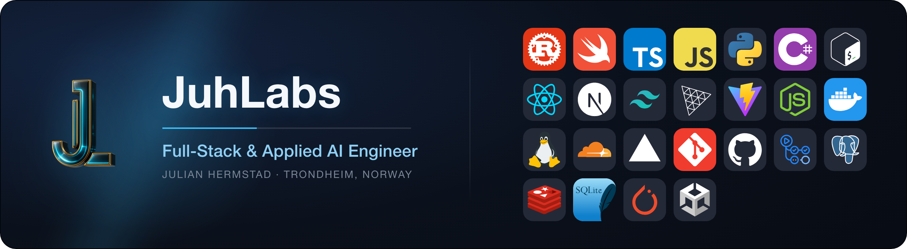
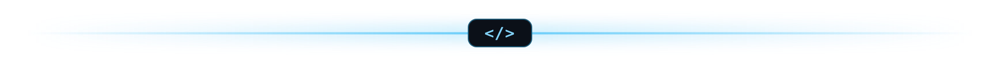
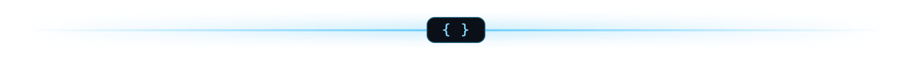
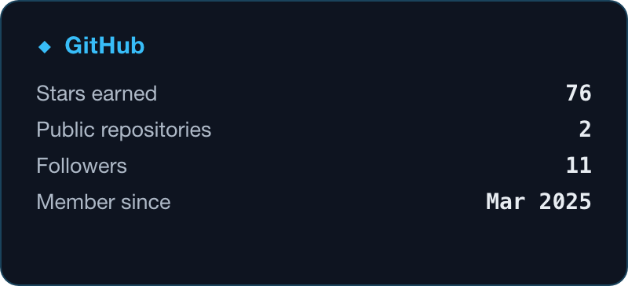
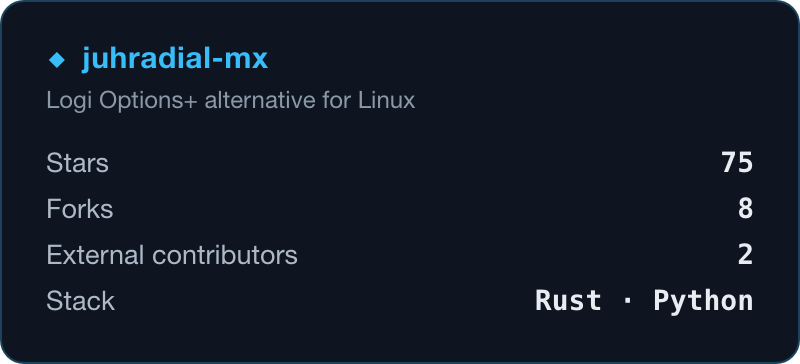
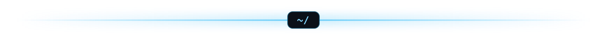
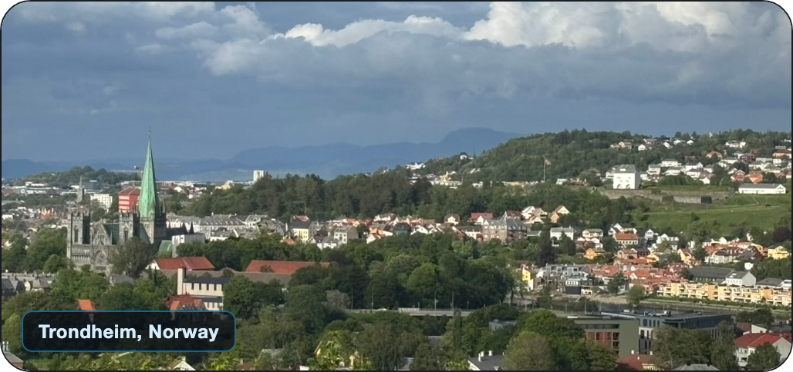

  

I turn AI demos into production-trustworthy systems: evals, verification gates, agent orchestration.

  
  
  

> "When I see people saying '99% of our code is written by AI,' I literally get angry. Because those same people, I can pretty much guarantee, 100% of their code is written by compilers."
>
> **Linus Torvalds**, Open Source Summit, 2026

### 🧭 Featured work

**[juhradial-mx](https://github.com/JuhLabs/juhradial-mx)**: a Logi Options+ alternative for Linux. A radial menu for Logitech MX Master mice on KDE Plasma 6, Hyprland, and Wayland. A Rust daemon reads the thumb-gesture button over evdev and a KWin overlay paints the menu, without ever touching the mouse firmware.

### 👋 About

- 🔭 Full-stack in the widest sense: native (SwiftUI for iOS and macOS, Rust and KWin desktop tools for Linux), web (Next.js and React in TypeScript, Tailwind, shadcn/ui), services and data (Rust and Python on PostgreSQL with row-level-security multitenancy, pgvector, Redis), C# games in Unity, and hand-written WebGL2 and GLSL shaders.
- 🧠 Applied AI well past API calls: I orchestrate many models side by side (Claude, OpenAI Codex, Nemotron, Qwen) across cloud and local runtimes (Ollama, vLLM, LiteLLM), built my own verify-gated agent loop and a code-graph MCP server, and pretrained a small language model from scratch on a single RTX 4080.
- 🧪 I treat the scarce skill as making AI output trustworthy, not just generating it: deterministic verification gates (Playwright and axe-core across breakpoints, test-exit-code oracles) and anti-reward-hacking guards that halt an agent loop if it edits its own tests.
- 🛠️ I operate the whole stack I build on: a Proxmox and Lima homelab over Tailscale, Cloudflare and Hetzner at the edge, self-hosted local models, plus an in-house generative media pipeline (image, video, 3D) for the products' own assets.
- ⚡ Fun fact: written by the AI I build with, which trains on our work. What it says it learned from me, and hopes stuck in its weights: name the reader before you build the oracle. A green test verifies the container, not the human it was for.

### 🧰 Stack

The tech-icon grid lives in the header above. In words:

**Languages:** Rust · Swift · TypeScript · JavaScript · Python · C# · Bash

**Frontend:** React · Next.js · Tailwind · three.js · Vite · Node.js

**Infrastructure, data, and ML:** Docker · Linux · Cloudflare · Vercel · Git · GitHub Actions · PostgreSQL · Redis · SQLite · PyTorch · Unity

**AI and LLM engineering**

- **Agents and orchestration:** Claude Code (headless `claude -p`), OpenAI Codex CLI, Nous Hermes, Model Context Protocol (MCP). Self-built: `perfect-loop` (verify-gated Plan / Execute / Verify engine), `brain` (deterministic zero-LLM vault retrieval), `codebase-memory` MCP (273k-node code graph).
- **Models and runtimes:** NVIDIA Nemotron (NIM), Qwen, Gemini, Ollama, vLLM + XGrammar, LiteLLM, OpenRouter, Cloudflare Workers AI.
- **Training and evaluation:** from-scratch LLM pretraining (PyTorch, byte-level BPE, GQA, Muon optimizer), SFT and instruction tuning, LLM-as-judge eval harnesses, HuggingFace.
- **Voice and vision:** Kokoro TTS (local, Dockerized), LocateAnything visual grounding.

<b>More: frameworks, infrastructure, and generative media</b>

 

- **Frontend detail:** SwiftUI, WebGL2 / GLSL shaders, three.js / React Three Fiber, GSAP, Payload CMS, Auth.js, OKLCH design tokens.
- **Infrastructure and DevOps:** Proxmox, Lima, LXC, Tailscale, Cloudflare (Tunnel / Workers / WAF), Hetzner, systemd, nftables, GitHub Actions, Playwright + axe-core, chrome-devtools.
- **Data:** pgvector + PostGIS, sqlx, Hono, Zod, SwiftData, node:sqlite.
- **Generative media:** Grok, fal.ai (Kling / FLUX), ComfyUI (local, RTX 4080), Wan / HunyuanVideo, RealESRGAN upscaling, ffmpeg, Unity 6, SpriteKit.

### 📊 GitHub

  
  

  <picture>
    <source media="(prefers-color-scheme: dark)" srcset="https://raw.githubusercontent.com/JuhLabs/JuhLabs/output/github-snake-dark.svg" />
    <source media="(prefers-color-scheme: light)" srcset="https://raw.githubusercontent.com/JuhLabs/JuhLabs/output/github-snake.svg" />
    
  </picture>

### 📍 Based in Trondheim, Norway

  

